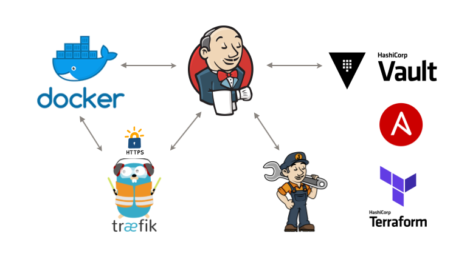
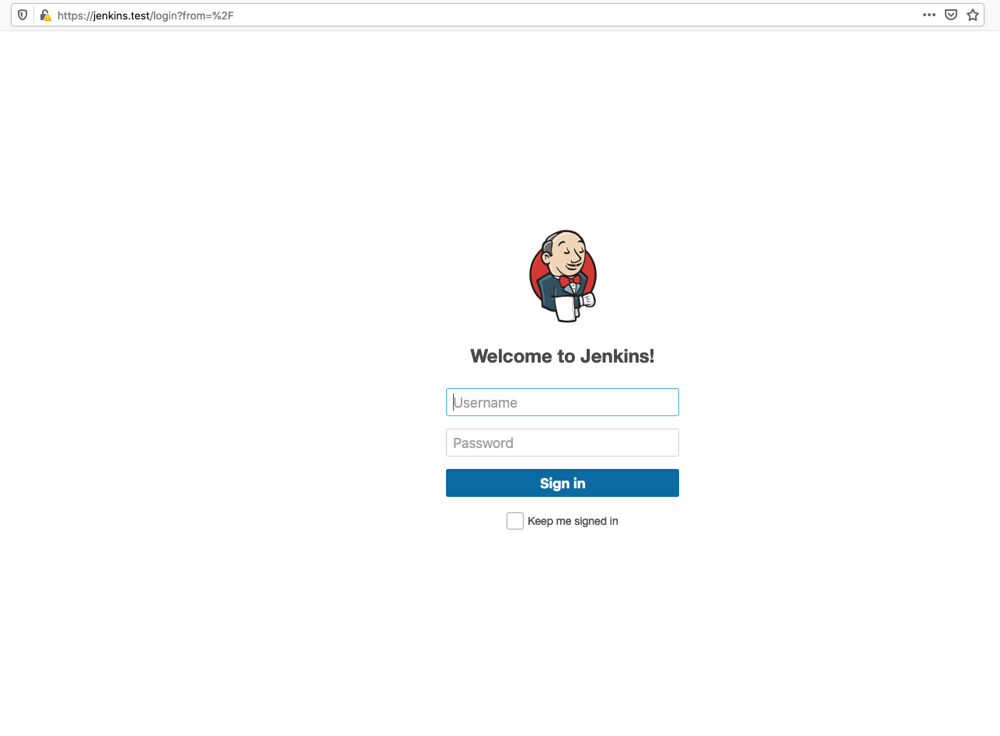
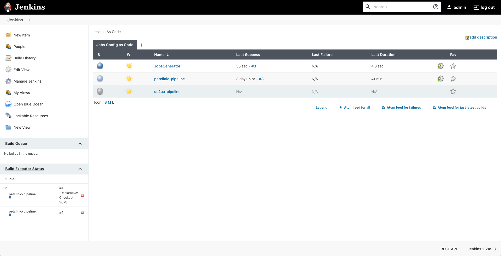

# Jenkins Configuration and Jobs as Code

[](https://jenkins.io/changelog-stable)

[](https://github.com/Kostua/Jenkins/actions)


> Run the fully automated installation of Jenkins from code with infrastructure, configuration, jobs, and plugins.

* [Introduction](#introduction)
* [System Requirements](#system-requirements)
* [Configuration](#configuration)
* [How To Use](#how-to-use)
* [Screenshots](#screenshots)
* [How its work](#how-its-work)
* [Status](#status)
* [Contact](#contact)

## Introduction
This is the implementation of ["Everything as a Code"](https://hackernoon.com/everything-as-code-explained-0ibg32a3) paradigm.
The desired state is to be able to build a Jenkins instance where all of its infrastructure, plugins, credentials, jobs, and many other things are versioned and stored in Git.

## System Requirements
This setup was built to support development on a Mac OS environment. 

- [Docker](https://www.docker.com/get-started)
- [Hashicorp Vault](https://github.com/Kostua/Vault)
- [Traefik](https://github.com/Kostua/traefik-docker)

## Configuration
Export necessary variables:

```
export VAULT_APPROLE='role_id'
export VAULT_APPROLE_SECRET='secret_id' 
```
[see this repo for deatail](https://github.com/Kostua/Vault)

## How To Use

```
git clone https://github.com/Kostua/Jenkins.git
cd Jenkins/
docker-compose up -d
```

## Screenshots



## How its work

There are five files that will be used in this example:

* Dockerfile - the definition of the Docker image 
* docker-compose.yml - a file that helps us get all the Docker stuff up and running
* plugins.txt - the plugins that will be pre-installed in Jenkins
* jenkins.yaml - the definition of Jenkins with predefined job repository

Dockerfile - the definition of the Docker image 
It defines which version of Jenkins that be used and it pre-installs some plugins and additional packages.

docker-compose.yml - This creates a docker image from the Docker file and run Jenkins with network infra and connect all pice together.

plugins.txt - It contains a list of plugins and versions that should be installed before Jenkins is started.

jenkins.yaml - this is the place where Jenkins Configuration as Code (a.k.a. JCasC) Plugin comes into play. It lets us define the global and plugin configurations through a YAML file. It’s great because it handles the configuration changes and we can deploy an initial Jenkins install with all the configurations already applied.

And this part is full predefined jobs from a repository and run all of them:
```
jobs:
  - script: >
      freeStyleJob('JobsGenerator') {
        triggers {
                    hudsonStartupTrigger {
                      quietPeriod("60")
                      runOnChoice("ON_CONNECT")
                      label("")
                      nodeParameterName("")
                }
          }
        scm {
            github('Kostua/jenkins_as_code_jobs', 'master')
        }
        steps {
            dsl {
              external('*.groovy')
            }
        }
      }
  - script: >
      queue('JobsGenerator')
```

## Status
Project is: _in progress_

## Contact
Created by [@kostua](mailto:kostua.p@gmail.com)- feel free to contact me!